# Chronos

A durable scheduler for [Claude Code](https://claude.com/claude-code) on macOS. launchd wakes it every
five minutes; any job that is due runs headless through `claude -p`, exactly once, even if your laptop
was asleep at the scheduled time. Jobs can also start on **events** (a new file, an email, a GitHub
release, a webhook), and every run is metered. A small local web UI lets you see, edit, run and pause
jobs, watch usage against your weekly limit, and look after the agents, skills and hooks around them.

Standard library only (bash and Python 3.9+), no pip, no npm. macOS.

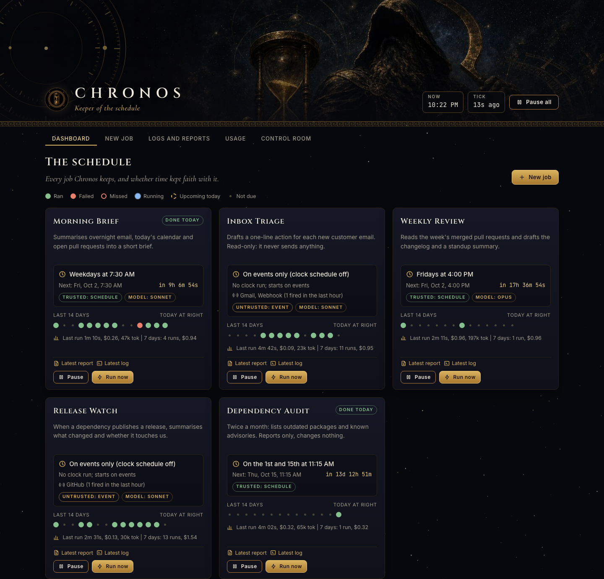

## Why

Claude Code has no durable scheduler. Its own in-session timers die with the session, and nothing in
it can start a run when a file lands or a pull request opens. A cron line that calls `claude` works until
the first time two things try to run the same job, or the machine sleeps through the fire time, or a
job hangs for an hour, or you cannot tell whether last Tuesday's run happened. Chronos is the small
amount of plumbing that makes scheduled Claude runs boring and reliable:

- **Runs once.** An atomic claim (`mkdir`) plus a done-marker per job per day. A live interactive
  session, the launchd runner and a manual "Run now" can all race; exactly one wins.
- **Catches up.** Each job has a catch-up window. Asleep at 09:00, awake at 09:40: it still runs.
- **Lets a live session go first.** The headless runner waits a grace period (default 10 minutes)
  so an interactive session that armed its own timer can take the job with full context.
- **Cannot hang forever.** A watchdog kills a run after 40 minutes (configurable).
- **Tells you when it fails.** A pluggable `notify` command (Telegram, a macOS banner, anything).
- **One-shot jobs.** "Remind me at 15:00" runs once, then switches itself off.
- **Starts on events.** A job can carry triggers: a file in a folder, a Gmail search, a GitHub repo, a
  webhook. Text that arrives from outside is untrusted, so event runs get a narrow tool list and
  **never** skip permissions. See [docs/triggers.md](docs/triggers.md).
- **Knows what it costs.** Every run is recorded (tokens, cost, model) and the UI shows how near the
  7-day and 5-hour limits sit.

### The HTTP 409 story

The lesson that shaped this project: a headless `claude` that loads a Telegram channel plugin starts a
*second* `getUpdates` poller on the same bot token. Telegram answers HTTP 409 (conflict) and the channel
of your live session dies, usually while you are not looking. Chronos disables those plugins in every
headless child by passing

```
claude -p --settings '{"enabledPlugins":{"telegram@claude-plugins-official":false,"imessage@claude-plugins-official":false}}' ...
```

The list is the `disable_plugins` config key. Delivery from Chronos itself is a plain command
(`notify`, for example `curl` against the Bot API), which never polls and so never conflicts.

## Features

**Scheduling**
- launchd tick, 5-minute interval, survives reboots and logouts
- `jobs.json` schedule: daily, weekdays, specific weekdays, days of month, or a one-shot date and time
- Per-job prompt in `jobs/<id>/prompt.md`, plus an optional locked `guard.md`
- Per-job `model` (passed as `--model`)
- **Restricted jobs (0.2.2)**: `"restricted": true` makes a job's scheduled runs use a narrow tool list instead of
  skipping permissions. See [Restricted jobs](#restricted-jobs)
- **Command jobs (0.2.1)**: a job can run a plain shell command instead of Claude, with the same claim,
  watchdog, log and notify and no tokens spent. See [Command jobs](#command-jobs)
- Pause one job or everything (`touch` a file, or a button); run now, with confirmation if it already ran today
- Version history for every prompt and schedule edit, with restore
- Reports and logs per run, viewable in the UI as plain text
- Optional SessionStart hook for in-session timers

**Event triggers (0.2.0)** - file, Gmail, GitHub and webhook triggers, a baseline on first check so history
never replays, a 6-runs-per-hour limit, untrusted-by-default event runs. [docs/triggers.md](docs/triggers.md)

**Usage meter (0.2.0)** - every run is parsed from `--output-format=stream-json` into `runs.jsonl`: tokens,
cost, model, turns, permission denials, and the latest 7-day / 5-hour limit utilisation.

**Control Room (0.2.0)** - agents, skills, hooks (with on/off switches for hooks that support one),
workspace health tiles you define, plugins and MCP servers (read from files, never started), and an
editor for the markdown that steers your agents, guarded by a sha conflict check and full history.
[docs/control-room.md](docs/control-room.md)

## Screenshots

| | |
|---|---|
| 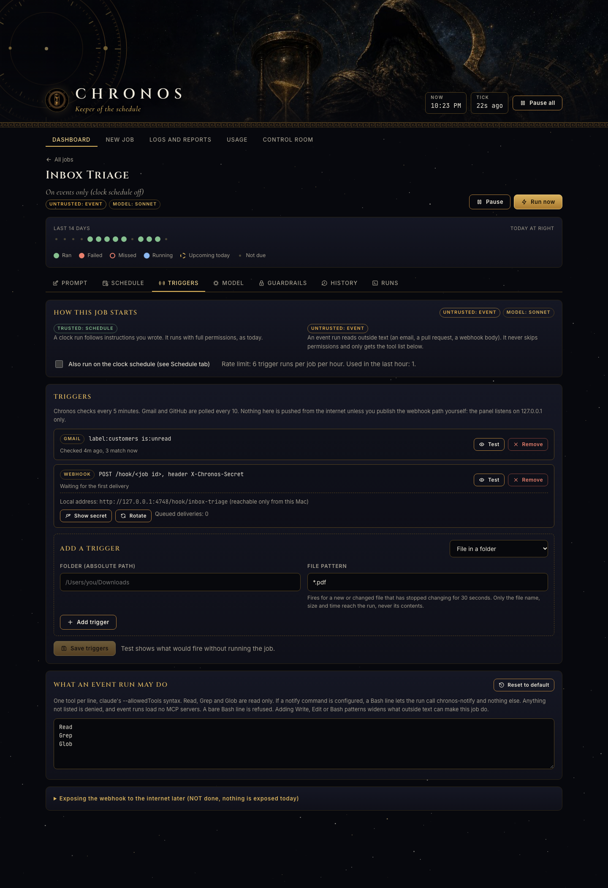 | 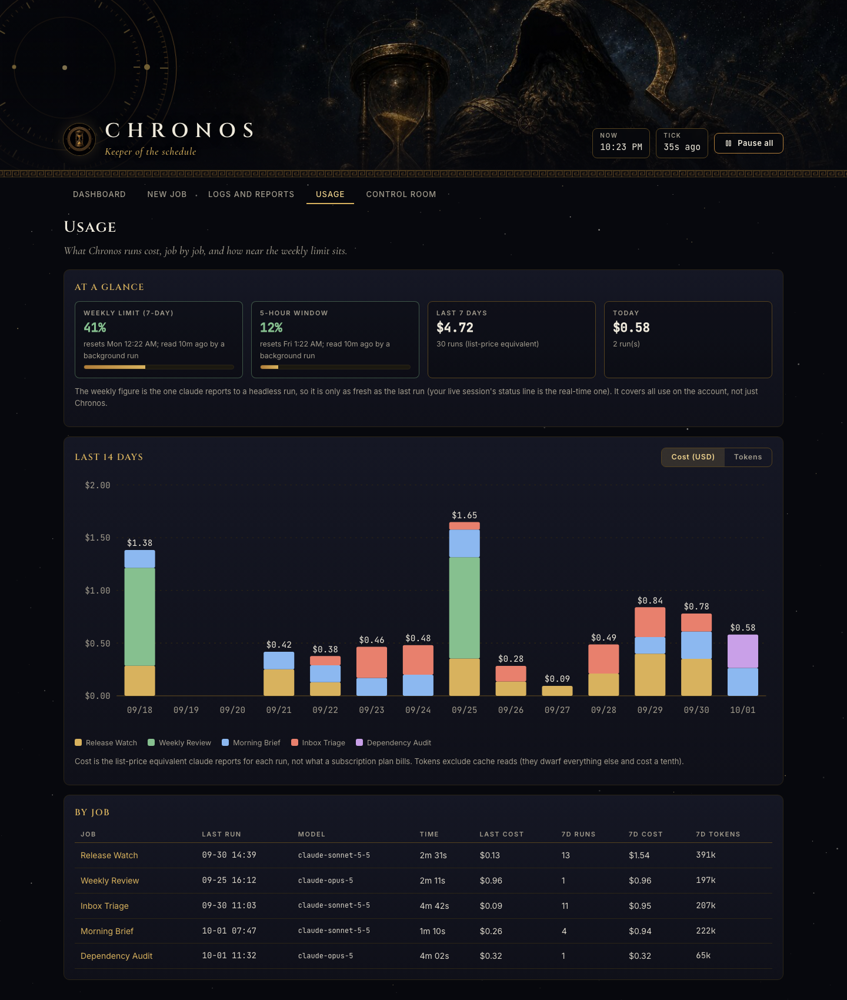 |
| 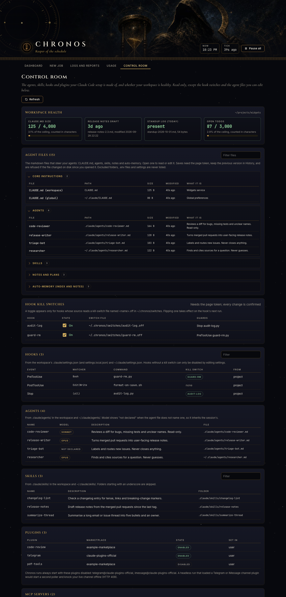 | 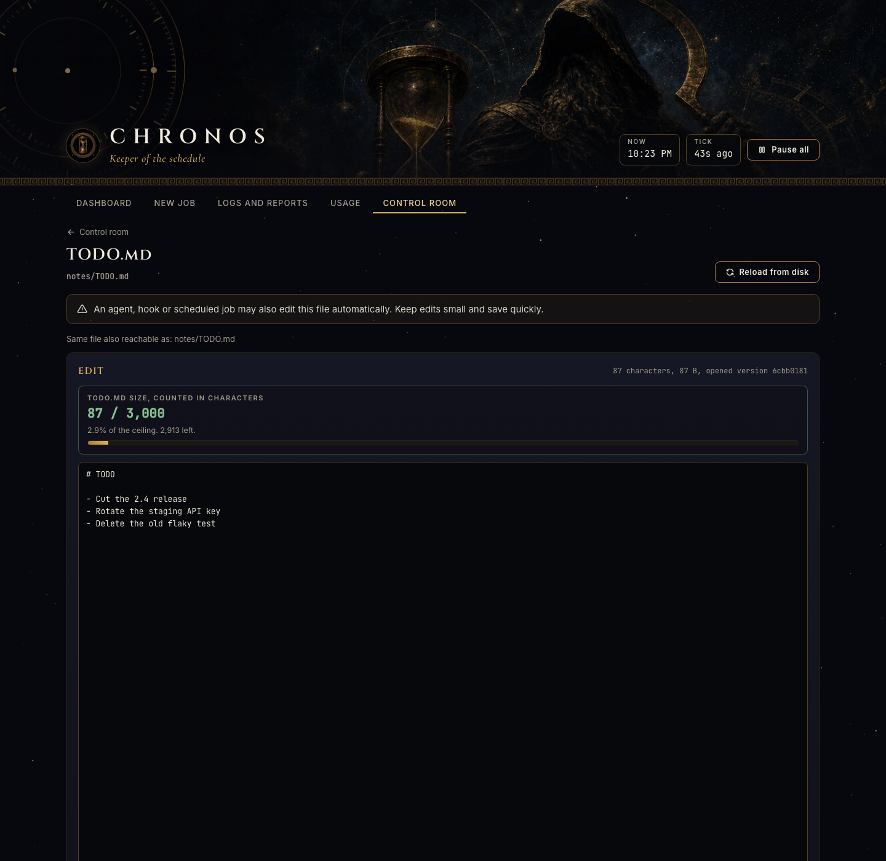 |
| 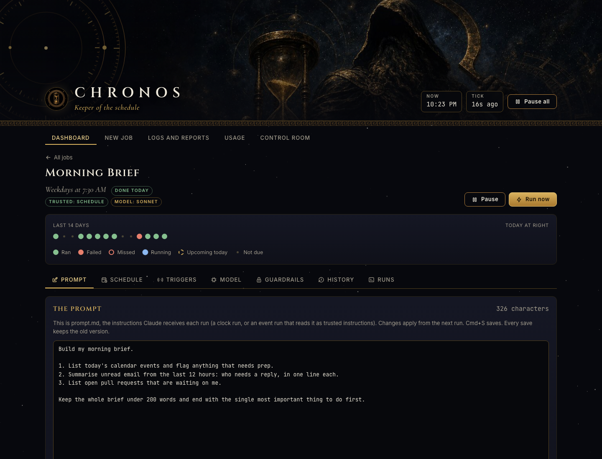 | 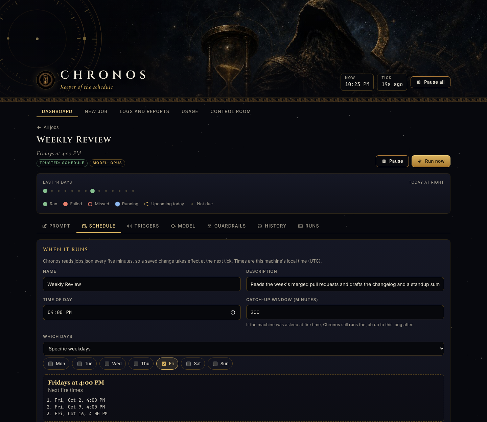 |
| 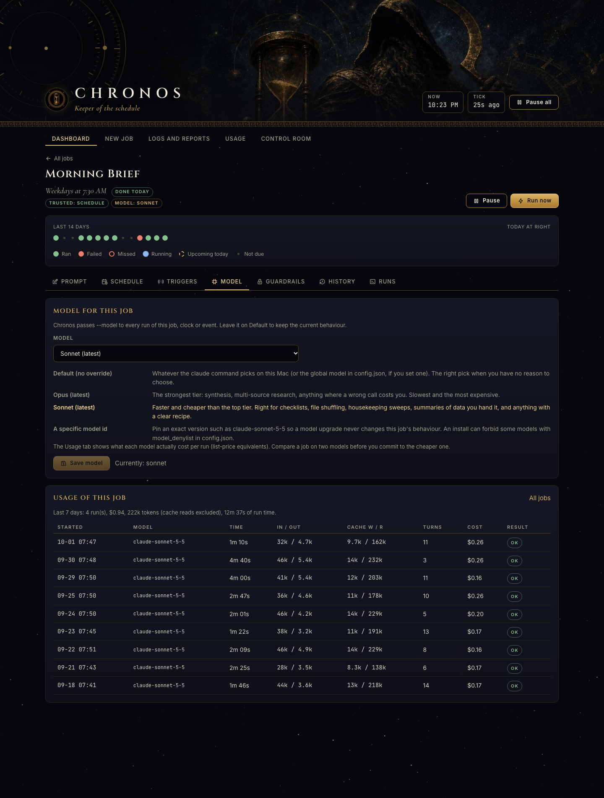 | 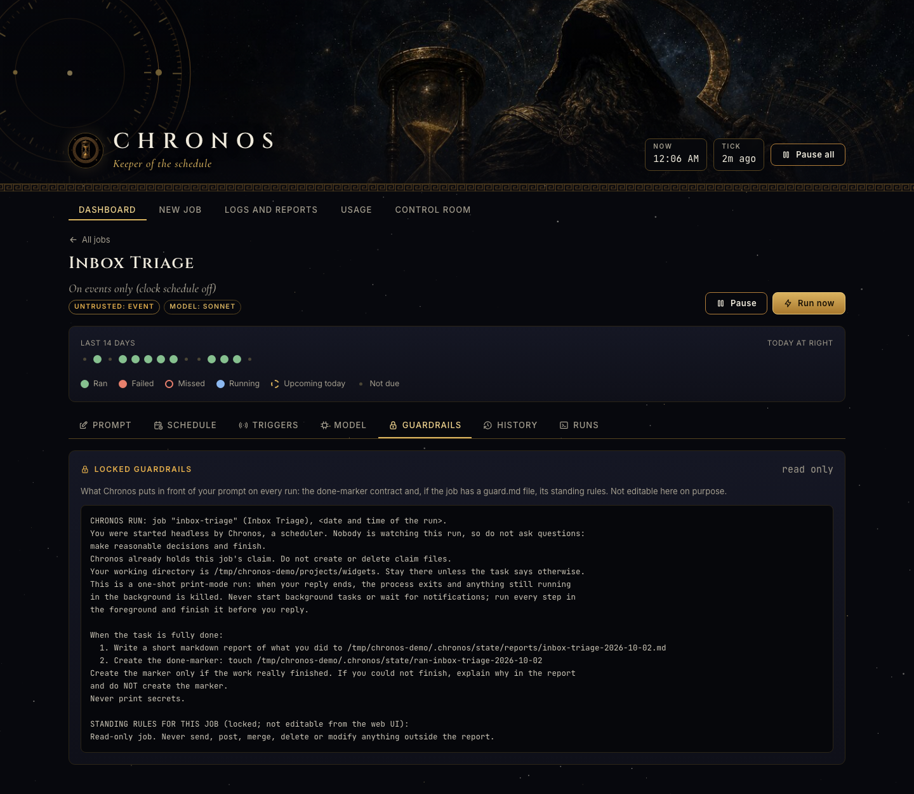 |
| 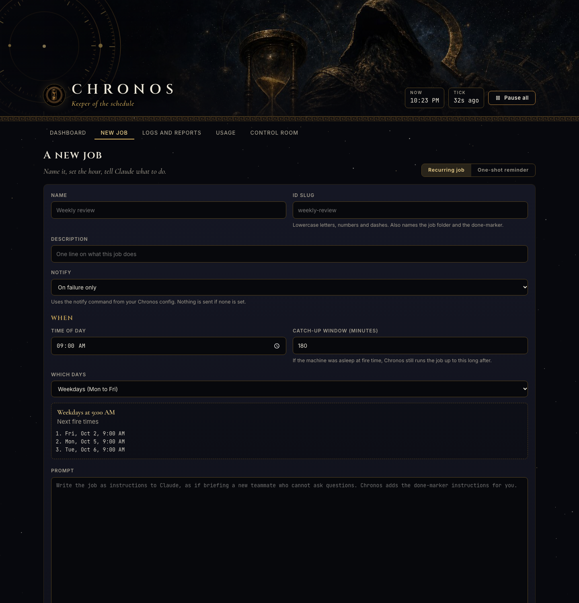 | 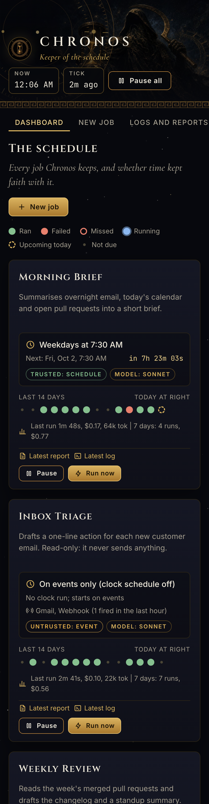 |

Phone width: [dashboard](docs/screenshots/phone-dashboard.png), [triggers](docs/screenshots/phone-triggers.png).
Every screenshot is taken against a demo workspace with made-up jobs ("Morning Brief", "Inbox Triage",
"Weekly Review", ...) and synthetic run history. Build the same demo yourself, with no install and no
real runs: `python3 tools/demo.py /tmp/chronos-demo`, then follow the two lines it prints.

## Requirements

- macOS (launchd). Linux and Windows are not supported.
- The [Claude Code CLI](https://claude.com/claude-code) installed and **already logged in**
  (run `claude` once by hand). Headless runs use that login and count against your usage.
- Python 3.9+ (the system `/usr/bin/python3` is enough) and `/bin/bash`.

## Install

```bash
git clone https://github.com/treynortetik-creator/chronos.git
cd chronos
./install.sh --workspace ~/code --with-examples
```

`install.sh` creates `~/.chronos/` and `~/.config/chronos/`, writes `config.json` from the template,
generates the UI token (mode 0600), renders both launchd plists with your paths and loads them with
`launchctl bootstrap gui/$(id -u)`. Then open <http://127.0.0.1:4747/>.

Options: `--workspace DIR`, `--port N`, `--no-ui`, `--no-load` (write files, load nothing),
`--copy` / `--no-copy`, `--with-examples`, `--force-config`, `--quiet` (one summary line, for another
installer that calls this one).

**Installed with `--no-load`?** Then nothing is running and nothing serves the UI yet. Start it by hand
(`$CONFIG` is `~/.config/chronos/config.json`, `$RUNTIME` is this checkout, or `~/.local/share/chronos`
if the installer copied the runtime out of Desktop, Documents or Downloads; the installer prints both):

```bash
# the scheduler: let launchd run it every 5 minutes (survives reboots) ...
launchctl bootstrap gui/$(id -u) ~/Library/LaunchAgents/io.github.chronos.tick.plist
# ... or run one tick by hand, right now (what launchd does every 5 minutes)
CHRONOS_CONFIG=$CONFIG bash $RUNTIME/bin/chronos-tick.sh

# the web UI: let launchd keep it up ...
launchctl bootstrap gui/$(id -u) ~/Library/LaunchAgents/io.github.chronos.ui.plist
# ... or run it in a terminal until you press Ctrl-C, then open http://127.0.0.1:4747/
CHRONOS_CONFIG=$CONFIG python3 $RUNTIME/ui/server.py
```

Uninstall: `./uninstall.sh` removes the two agents and keeps your data; `./uninstall.sh --purge` deletes
`~/.chronos`, `~/.config/chronos` and any copied runtime.

The agents are labelled `io.github.chronos.tick` and `io.github.chronos.ui`.

> **macOS protected folders.** If the folder your jobs work in (the `workspace`) lives in `~/Desktop`,
> `~/Documents` or `~/Downloads`, every Claude Code auto-update makes macOS ask "would like to access
> files in your Desktop folder", and background runs are silently blocked until you click Allow. Keep
> the workspace outside those folders, for example `~/agent` or `~/code`.

### launchd and macOS privacy (TCC)

macOS can refuse to let a launchd job read files under `~/Desktop`, `~/Documents` and `~/Downloads`
(the TCC privacy prompts). A script that works in your terminal then fails silently under launchd.
Two mitigations, both used here:

1. **Install outside those folders.** If you run `install.sh` from a checkout under Desktop, Documents
   or Downloads, it automatically copies the runtime to `~/.local/share/chronos` and points the plists
   there (re-run it after `git pull` to refresh the copy). `--no-copy` overrides this.
2. **A bash wrapper.** The UI plist starts `/bin/bash -c "exec python3 server.py"` rather than Python
   directly. In the author's setup bash was permitted where the system Python was not. If your UI log
   (`~/.chronos/logs/ui.err`) shows `PermissionError`, use `--copy`.

## Quick start

```bash
bin/chronos list              # your jobs and their next fire times
```

1. Open the UI, open **Daily Summary**, read its prompt, tick **Enabled**, save.
2. Press **Run now** once to watch a real headless run (it appears as Running, then Done today).
3. Optional: add notifications. Edit `~/.config/chronos/config.json`:

```json
"notify": "/path/to/chronos/examples/notify/macos.sh"
```

   or Telegram: copy `examples/notify/telegram.sh` somewhere, create `~/.config/chronos/notify.env`
   (`chmod 600`) with `TELEGRAM_BOT_TOKEN=...` and `TELEGRAM_CHAT_ID=...`, and point `notify` at it.
   Tokens live only in that file, never in this repo.

Command line: `chronos run <id>`, `chronos claim <id> [--unattended]`, `chronos done <id>`,
`chronos prompt <id>` (prints exactly what a headless run would receive), `chronos due`,
`chronos triggers --dry` (what the trigger pass would fire, changing nothing).

## Jobs

Everything about a job is a `jobs.json` entry plus a folder:

```
~/.config/chronos/
  config.json
  jobs.json
  jobs/
    daily-summary/
      prompt.md        what Claude is asked to do (editable in the UI)
      guard.md         optional standing rules, shown read-only in the UI, added ahead of prompt.md
```

### jobs.json schema

A JSON list of objects:

| Field | Type | Meaning |
|---|---|---|
| `id` | string | `^[a-z0-9-]{2,40}$`. Names the folder and every marker file. |
| `name` | string | Display name, up to 60 characters. |
| `description` | string | One line, shown on the dashboard. |
| `time` | `"HH:MM"` | 24-hour local fire time. |
| `days` | string | `daily`, `weekdays`, a list like `mon,wed,fri`, or `dom:1,15` (days of month). |
| `once` | `"YYYY-MM-DDTHH:MM"` or `null` | Makes it a one-shot. `time` and `days` are then ignored. The job disables itself after a successful run. |
| `catchup_min` | int 15-1440 | How long after the fire time Chronos may still start it. Default 180. |
| `enabled` | bool | Only `true` jobs run. |
| `in_session` | bool | Also arm in an interactive session (needs the optional hook). |
| `notify` | `failure` \| `always` \| `never` | When the `notify` command is used for this job. Default `failure`. |
| `model` | string | Optional per-job `--model`: `opus`, `sonnet`, `haiku` or a full id such as `claude-sonnet-5-5`. Overrides the global `model`. |
| `kind` | `claude` \| `command` | Default `claude`. `command` runs `command` as a shell command instead of Claude, see [Command jobs](#command-jobs). |
| `command` | string | The shell command of a `command` job (up to 2000 characters). |
| `clock` | bool | `false` makes an event-only job: no clock schedule, it starts only on `triggers`. Default `true`. |
| `triggers` | list | Event triggers, see [docs/triggers.md](docs/triggers.md). Not allowed on one-shots. |
| `allowed_tools` | list | Tool list for this job's **event** runs, and for its **scheduled** runs when `restricted` is `true` (`--allowedTools` syntax). Default: the `event_allowed_tools` config key. |
| `restricted` | bool | `true`: scheduled runs of this job get the narrow tool list (no `--dangerously-skip-permissions`, none of `claude_args`). Default `false` (unchanged behaviour). See [Restricted jobs](#restricted-jobs). |
| `created`, `updated` | ISO timestamp | Bookkeeping. |

A job is **due** when it is enabled, scheduled today, past `time + grace_min`, inside `catchup_min`, not
paused, has a `prompt.md` (a command job needs none), and has no `ran-`, `claim-` or `failed-` marker for the day. Event runs use their own `claim-<id>-<date>-<hash>` and
`ran-<id>-<date>-<hash>` markers and never touch the clock run's. A failed day is
not retried automatically; press Run now (or delete `failed-<id>-<date>`).

### What a headless run receives

`chronos prompt <id>` prints it. In order: a short preamble (job id, time, working directory, the
done-marker contract), `guard.md` if present, then `prompt.md`. The contract tells Claude to write a
report to `<state_dir>/reports/<id>-<date>.md` and `touch` the done-marker when finished. By default a
run also counts as successful if `claude` exits 0 without touching the marker; set
`"require_marker": true` to insist on the marker.

### Command jobs

Some scheduled work is not a Claude task: refreshing a search index, rotating a log, syncing a folder.
Running `claude -p` just to start a script spends your plan for nothing. A command job runs the script
itself:

```json
{"id": "refresh-index", "name": "Refresh index", "kind": "command",
 "command": "cd ~/agent && python3 scripts/index.py --quiet",
 "time": "06:41", "days": "daily", "catchup_min": 240, "enabled": true, "in_session": false, "notify": "failure"}
```

- `command` runs through `/bin/bash -c`, with the workspace as its working directory, `CHRONOS_JOB` and
  `CHRONOS_RUN=1` in its environment, stdin closed, and the same `PATH` a Claude job gets. At most 2000
  characters, so for anything longer point it at a script.
- It needs **no `prompt.md`**. It does not start `claude`, spends no tokens and shows as `(command)` on the
  Usage page.
- Success is exit code 0 inside the watchdog (`timeout_min`). Anything else marks the day failed and
  notifies, exactly like a Claude job. Output (stdout then stderr) becomes the run log; the last 40 lines
  become the report.
- It runs on its clock schedule only: `triggers`, `clock: false` and `in_session: true` are refused, because
  text that arrives from outside must never reach a shell.
- The web UI shows the command read-only. It cannot create or edit one; change `command` in `jobs.json`
  (it is your machine and your file, the same trust you give `claude_args`).

### Examples

`examples/jobs.json` and `examples/jobs/` contain `daily-summary` (git activity digest),
`weekly-cleanup` (read-only housekeeping scan with a `guard.md`) and `remind-me-once` (a one-shot). All
ship disabled.

## Events, in one minute

```json
{"id": "pdf-digest", "name": "PDF Digest", "clock": false, "enabled": true, "notify": "always", "model": "sonnet",
 "triggers": [{"type": "file", "path": "~/Downloads", "glob": "*.pdf"}]}
```

Every tick, after the clock jobs, Chronos checks each trigger. The first check only records what already
matches (a baseline) and fires nothing. After that each new item starts one headless run whose prompt is
your `prompt.md` (trusted) followed by the item's details inside a clearly marked **untrusted data**
block. That run is read-only by default. The full story, including what Gmail and GitHub triggers need
installed, is in [docs/triggers.md](docs/triggers.md).

## Config reference

`~/.config/chronos/config.json` (override the path with `CHRONOS_CONFIG`). Every key is optional.

| Key | Default | Meaning |
|---|---|---|
| `workspace` | `~/chronos-workspace` | Directory headless runs start in. Point it at your code. |
| `state_dir` | `~/.chronos/state` | Done-markers, claims, `reports/`, `notices/`. |
| `logs_dir` | `~/.chronos/logs` | One log per run, plus `chronos.log`. |
| `home_dir` | `~/.chronos` | `PAUSED`, `paused-jobs/`, heartbeat, `ui-token`, `history/`. |
| `jobs_file` | `~/.config/chronos/jobs.json` | The schedule. |
| `jobs_dir` | `~/.config/chronos/jobs` | `<id>/prompt.md` folders. |
| `ui_port` | `4747` | Web UI port (127.0.0.1). |
| `claude_bin` | `claude` | The CLI to run. |
| `claude_args` | `["--dangerously-skip-permissions"]` | Extra flags for `claude -p`. See the permissions note below. |
| `model` | `""` | Passed as `--model` when set. |
| `disable_plugins` | telegram + imessage official plugins | Plugins turned off in the child (the 409 fix). |
| `notify` | `""` | Command run as `<notify> "<message>"`. Empty means no notifications. |
| `timeout_min` | `40` | Watchdog limit per run. Keep it below `stale_claim_min`. |
| `grace_min` | `10` | Delay before the headless runner takes a job. |
| `stale_claim_min` | `45` | A claim older than this belongs to a run that died and is swept. |
| `require_marker` | `false` | Count a run only if the job wrote the done-marker. |
| `path` | `~/.local/bin`, `/opt/homebrew/bin`, `/usr/local/bin` | Prepended to `PATH` for runs (launchd's PATH is minimal). |
| `event_allowed_tools` | `["Read","Grep","Glob"]` | Default tool list for event runs. When `notify` is set, the notify sender is added automatically. |
| `event_deny` | `[]` | Extra `--disallowedTools` rules for event runs, on top of the built-in secret-path denies. |
| `event_rate_per_hour` | `6` | Event runs per job per hour (1-60). |
| `gmail_command` | `""` | Gmail trigger adapter command, see [docs/triggers.md](docs/triggers.md). Empty = Gmail triggers report that they are not set up. |
| `gh_bin` | `""` | Path to the `gh` CLI for GitHub triggers. Empty = look on `PATH`. |
| `hook_hosts` | `[]` | Extra `Host` values accepted on `POST /hook/<id>` only (a tunnel's public name). Also `CHRONOS_HOOK_HOSTS`. |
| `model_denylist` | `[]` | Substrings a per-job model may not contain, e.g. `["haiku"]`. |
| `claude_home` | `~/.claude` | Where the Control Room reads user-level settings, agents and skills. |
| `kill_switch_dir` | `<home_dir>/switches` | Where hook kill switches (`<name>.off`) live. |
| `health_checks` | `[]` | Workspace health tiles, see [docs/control-room.md](docs/control-room.md). |
| `agent_files_extra` | `[]` | More markdown the editor may list (globs, categories, size ceilings). |
| `agent_files_exclude` | `[]` | Globs the editor must never list (for example a private notes folder). |
| `agent_files_lint` | `""` | Command run after saving the workspace `CLAUDE.md`; its output is shown. |

Timezone is the system timezone; there is no setting. Environment variables for testing:
`CHRONOS_NOW=2026-10-05T09:00` (fake clock), `CHRONOS_DRYRUN=1` (tick prints, claims nothing).

**Permissions note.** Nobody is at the keyboard during a headless run, so `claude -p` cannot ask for
approval. For **clock runs** the default `--dangerously-skip-permissions` lets the job do anything your
user can do. That is the right default for a tool you point at your own prompts, and the wrong one if a
prompt can be influenced by untrusted input. **Event runs never use it** (and ignore `claude_args`
entirely); see the security model. A job with `"restricted": true` gives its clock runs the same narrow
treatment, see [Restricted jobs](#restricted-jobs). To tighten every job at once use `claude_args`, for example
`["--permission-mode", "acceptEdits", "--allowedTools", "Read", "Bash(git log:*)"]`, and use `guard.md`
for rules a job must keep.

## Restricted jobs

Added in 0.2.2. By default a scheduled (clock) run is started with your `claude_args`, which is
`--dangerously-skip-permissions`: the job is trusted, so a prompt that says "never send anything" is a request,
not a lock. Set `"restricted": true` on a job and its scheduled runs are launched the way event runs are:

- `--permission-mode=default`, so anything outside the allow list is **denied** (nobody is there to approve it)
- `--allowedTools` = the job's `allowed_tools`, or, when it has none, `Read`, `Grep`, `Glob` plus the notify sender
- `--tools` limited to the built-ins that list names, `--strict-mcp-config` unless the list names an `mcp__` tool
- `--disallowedTools` for `.env` files, `~/.ssh`, `~/.aws`, `~/.gnupg`, `~/.config` (gh, gcloud and most CLI tokens),
  `~/.docker`, `~/.kube`, `~/.netrc`, `~/.npmrc`, `~/.pypirc`, `~/.git-credentials`, `~/.pgpass`, the Keychains folder,
  Chronos's own folders and Claude's credentials. This list is best effort: a deny list cannot be complete, and the real
  boundary is a **folder-scoped** `Read(//path/**)` (with `Grep` and `Glob` scoped the same way), which is what Talos ships
- `--setting-sources=` (new in the review of 0.2.2): **no user, project or local settings file is read.** Claude Code merges
  saved permissions from `~/.claude/settings.json`, the agent folder's `.claude/settings.json` and `settings.local.json`
  on top of `--allowedTools`, so a `Bash(curl:*)` or whole-MCP-server allow you once clicked "always allow" on would
  otherwise still apply. What is passed back through `--settings` is exactly: the agent folder's `hooks` (the safety guards),
  its `autoMemoryEnabled`, `permissions.deny` merged from the user, project and local files (a deny can only narrow), and the
  user's own `apiKeyHelper` (needed to start at all when auth is a key helper). No allow rule, no `env`, no plugin or MCP
  setting. **Hooks are code, and a hook can answer "allow"**, so the files that define them are write-protected in these runs:
  `--disallowedTools` denies `Edit` (which covers Write) on the workspace's `.claude/`, `.git/`, `.mcp.json` and every folder a
  hook command runs a script from (found by reading `$CLAUDE_PROJECT_DIR/<path>` out of the hook commands, e.g. Talos's
  `hooks/`). A job you give broad Edit on the workspace therefore still cannot rewrite a hook or plant an approval
- Side effects of reading no settings file: the folder's `CLAUDE.md` is not auto-loaded (a prompt that needs it must read it);
  a user-level `enabledPlugins` entry (and any MCP server a plugin brings) and a project `.mcp.json` server that needed approval
  in a settings file do not load. MCP servers that come from your account (claude.ai connectors) did load in a restricted run
  with their tool named in `allowed_tools` (checked 2026-10-07); a failing job is the safe outcome, and the report says why
- never `--dangerously-skip-permissions`, and none of `claude_args`
- the same `--setting-sources=` rule applies to **event runs**

A restricted run cannot write its own report or done-marker (it has no Write tool unless you allow one), so
**Chronos writes them** from the final message, exactly as it does for an event run. Success means a clean exit
inside the watchdog with no error result; `require_marker` does not apply to a restricted job. A run in which the
permission system refused **every** tool call it made is a failure (nothing was done), and refusals are always noted at
the end of the report.

```json
{"id": "weekly-lint", "name": "Weekly lint", "time": "08:17", "days": "mon", "restricted": true,
 "allowed_tools": ["Read", "Grep", "Glob",
                   "Edit(//Users/me/agent/memory/briefs/**)",
                   "Bash(python3 /Users/me/agent/scripts/lint.py:*)"], ...}
```

Rules worth knowing (checked against Claude Code 2.1.x, 2026-10-07):
- Path rules: `//abs/path/**` is an absolute path. Use `Edit(...)`: it covers Write, Edit and MultiEdit.
  `Write(//...)` did not match in testing.
- A `Bash(<prefix>:*)` rule allows any command that STARTS with the prefix. Name a script, not an interpreter.
  A rule without `:*` matches that exact command only. Chaining (`a && b`) is split and each part must match.
- Claude Code itself lets read-only shell commands through in default mode (`ls`, `head`, `grep`, `git status`,
  `date`). That is read access inside the working directory, not write access.
- A job with `"restricted": true` cannot also be `in_session`: a live session runs with the session's own
  permissions, which Chronos cannot narrow. The pair is refused.
- `restricted` must be `true` or `false`. Anything else (`"true"`, `1`, `null`) is invalid: the tick skips the job, Run now
  refuses it, and `chronos-run.sh` fails the run before starting `claude`. It is never read as "unrestricted".
- It does not apply to command jobs (they run one fixed shell command and have no tools).
- `"restricted": false`, or leaving the field out, keeps the old behaviour: that is the opt-out.

## Optional: SessionStart hook

Chronos does not need it. It is for people who want an interactive Claude Code session to run jobs
in-session (full context, sub-agents, the exact minute) while Chronos stays the backstop. At session
start it tells Claude which `in_session` jobs to arm as timers (each begins with
`chronos claim <id> --unattended`, which refuses a job that is not scheduled today), flags overdue jobs,
and reports jobs the headless runner finished since you last looked. Register it in a project's
`.claude/settings.json`:

```json
{"hooks": {"SessionStart": [{"hooks": [{"type": "command",
  "command": "python3 /path/to/chronos/hooks/chronos-session-start.py"}]}]}}
```

Inside a headless Chronos run the hook stays silent (`CHRONOS_RUN=1`).

## Security model

The UI can start `claude` with permissions skipped, and event triggers feed it text from the outside
world, so both are locked down.

**The web UI**
- Binds `127.0.0.1` only. The `Host` header must be `127.0.0.1:PORT` or `localhost:PORT` (DNS-rebinding guard).
- Every mutating request (POST/PUT/DELETE) needs the `X-Chronos-Token` header matching
  `~/.chronos/ui-token` (mode 0600). The page gets the token injected server-side. A browser `Origin`
  header, when present, must be the UI's own.
- Reading agent-file contents also needs the token (the Control Room lists metadata without it, and never
  returns hook arguments, MCP args, environment or headers).
- Job ids match `^[a-z0-9-]{2,40}$`. File names are matched against strict patterns and resolved back
  under their directory; there is no way to name a path outside `logs/`, `reports/` or `history/`.
- Logs, reports and prompts are served as `text/plain` and rendered with `textContent`, never as HTML.
  A CSP (`script-src 'self'`) and `nosniff` back that up.
- `guard.md` is never written by the UI.

**The webhook** (`POST /hook/<job id>`)
- It lives on the same 127.0.0.1-only listener. Nothing is reachable from the network unless you publish
  the `/hook/` path yourself (a tunnel), and then only the hostnames in `hook_hosts` are accepted there.
- It needs the **job's own secret** in `X-Chronos-Secret` (32+ random bytes, stored `0600` under
  `~/.chronos/hook-secrets/`, compared in constant time). The UI token is not a webhook credential.
- Bodies over 64 KB are refused, the queue holds 20 deliveries per job, ten wrong secrets in a minute
  lock that hook for a minute, and a paused or disabled job accepts nothing.

**Event runs** (anything a trigger starts)
- The payload (email, pull request, file name, webhook body) is **untrusted**: control and invisible
  characters are stripped, it is cut at 4,000 characters and placed inside a nonce-marked
  `UNTRUSTED EVENT DATA` block after your trusted instructions, with an explicit rule not to follow it.
- The child runs `--permission-mode=default` with a narrow `--allowedTools` list (default `Read`, `Grep`,
  `Glob`, plus the notify sender if you set one), `--tools` limited to the built-ins that list needs,
  `--disallowedTools` for `.env` files, `~/.ssh`, `~/.aws`, `~/.gnupg`, Chronos's own home and config
  folder and Claude's credentials (deny rules beat allow rules), and `--strict-mcp-config` so no MCP
  server loads. **It is never given `--dangerously-skip-permissions`, and none of `claude_args`.**
- A rate limit (default 6 runs per job per hour) bounds the damage of a flood. A failed event run is
  reported and not retried.
- Residual risk, stated plainly: `Read` can read any file that is not on the deny list, and the notify
  command can send what it read to you. Widening `allowed_tools` (Write, Edit, Bash patterns) widens what
  outside text can make the job do. Keep event jobs read-only unless you mean otherwise.

**Every headless run**
- The `telegram` and `imessage` channel plugins are disabled in the child through `--settings` (the 409
  story above).
- The prompt tells the child it is a one-shot print-mode run, so background tasks die with it: it must do
  everything in the foreground.
- Atomic `mkdir` claims, a watchdog, and a stale-claim sweep make "exactly once" survive crashes.

Anyone who can read `~/.chronos/ui-token` or run code as you can start jobs; that is the same trust as
your own shell. Do not expose the UI port with a tunnel or proxy; publish only `/hook/` if you must.

The test suite checks the token, Host/Origin rejection, traversal attempts, plain-text serving, the
loopback-only bind, the webhook secret and throttle, and that no event run ever carries the skip-permissions flag.

## Tests

```bash
tests/run.sh
```

144 tests, about a minute. They cover the tick's due logic with a fake clock (grace, catch-up, days,
markers, pause, one-shots, a broken `jobs.json`), concurrent claims, the run script against a fake
`claude` (success, failure, watchdog, one-shot disabling, the plugin-disable flags), the hook, the UI's auth
and path rules, and for 0.2.0: every trigger type (baselines, settling, rate limit, missing Gmail/`gh`
tooling), event-run flags and prompts, per-job models, the usage meter (stream parsing, truncation), the
Control Room, the agent-file allowlist and conflict guard, the webhook, the demo workspace, command jobs
(run, fail, watchdog, UI refusals), and a full
`install.sh --no-load` into a throwaway `HOME`. Nothing touches launchd, a real `gh` or Gmail, or your
real `claude`: the CLI is replaced by `tests/fake-claude.sh`.

## Limitations

- macOS only (launchd). The scripts use `/bin/bash` 3.2-compatible syntax; Linux would need a systemd port.
- Needs a logged-in Claude Code CLI. Chronos does not manage authentication.
- The tick runs every 5 minutes, so jobs start up to 5 minutes (plus the grace period) after their time.
- A sleeping laptop runs nothing; catch-up windows cover the gap after wake, not a day-long absence.
- One run per job per day. Jobs that should run several times a day are modelled as several jobs.
- Success is judged by marker or exit code, not by reading Claude's answer. (Event runs also fail on an error result.)
- Event triggers poll every 5 minutes (Gmail and GitHub every 10); nothing is pushed to the Mac. A webhook is
  queued and picked up at the next tick.
- The usage meter reads Claude Code's `stream-json` output (checked against 2.1.x). If a future version
  changes its shape, usage shows as unknown and the raw output stays as the log; runs are unaffected.
- The weekly-limit reading is only as fresh as the last headless run.
- The plugin names in `disable_plugins` are the official ones. If you use another channel plugin that
  polls, add its id.

## FAQ

**Does it work on a Mac that is asleep?** The job runs after wake if you are still inside its catch-up window.

**Why not plain cron?** Cron has no catch-up, no claim, no watchdog, no failure alert and no history. launchd also
starts jobs in the right user session.

**Why a done-marker file instead of a database?** A file is atomic, greppable, survives crashes and is easy to inspect.

**A job says Failed. Now what?** Open Runs, read the log. Fix the prompt, then press Run now; that clears the failed marker.

**Can two things run at once?** Different jobs, yes. The same job on the same day, no.

**Can Claude message me mid-run?** If `notify` is configured, a clock run's preamble tells it about `bin/chronos-notify "text"`, and an event run gets exactly that one command added to its tool list.

**Why did my Gmail/GitHub trigger say "not set up"?** They need an adapter or the `gh` CLI; see the prerequisites table in [docs/triggers.md](docs/triggers.md). Other triggers on the same job keep working.

**How do I move it to another Mac?** Copy `~/.config/chronos`, run `install.sh`.

## Credit and license

Written by Treynor Tetik with Claude. MIT licensed, see [LICENSE](LICENSE).
